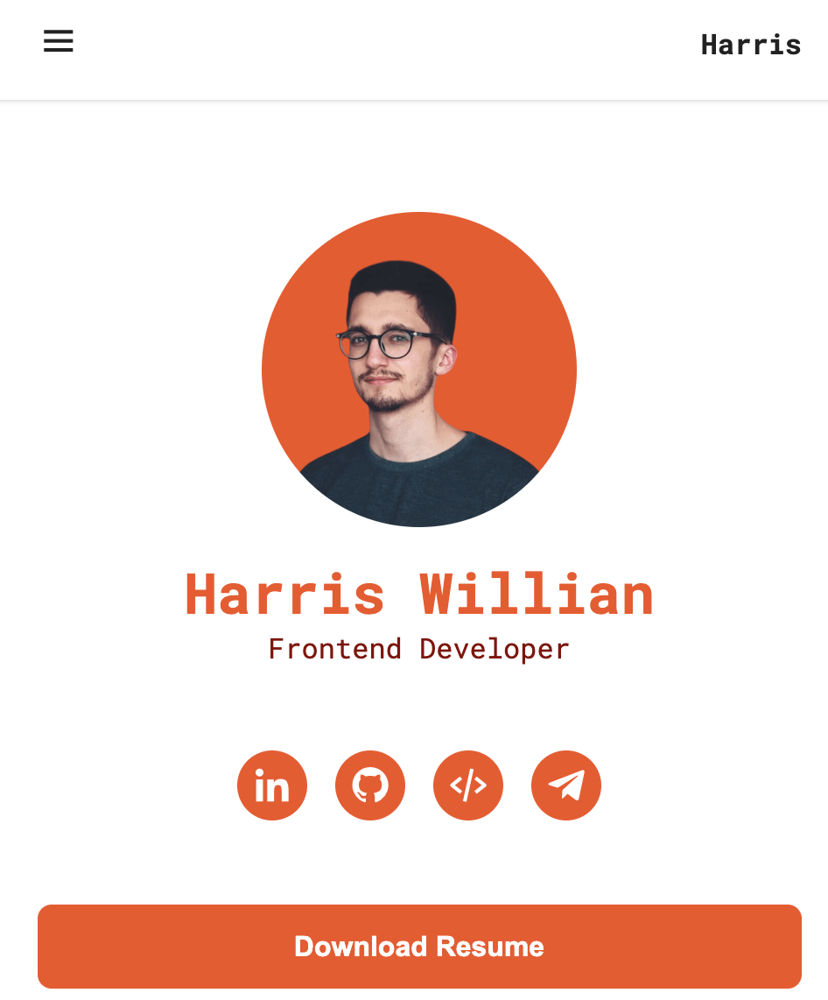

# responsive-personal-orange-portfolio

**專案靈感來自於[Bedimcode](https://youtu.be/owEHlDn0JYQ)的影片**

不使用前端框架切版，重溫手切的感動

- [Live Demo](https://connectshark.github.io/responsive-personal-orange-portfolio/index.html)

## 專案內容

- 多樣html tag(form, input, aside, button, header)
- 使用CSS變數
- 使用script defer功能
- 使用媒體查詢是否為手機裝置(hover: hover)